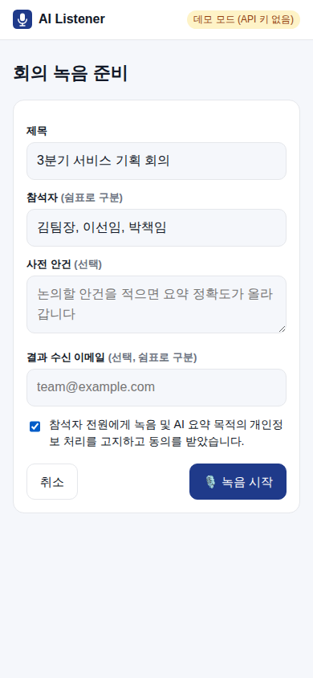
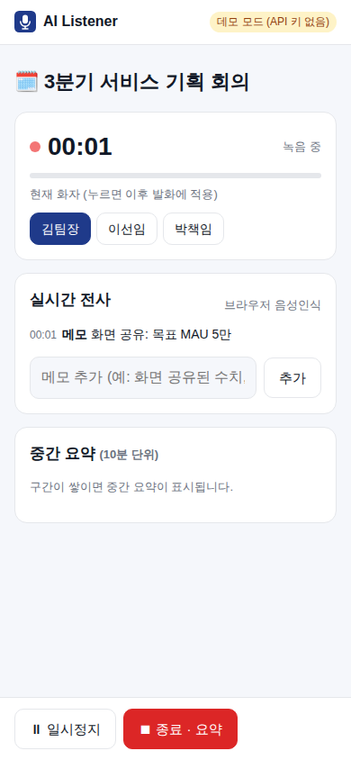
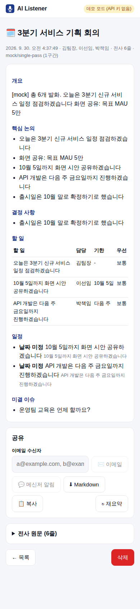
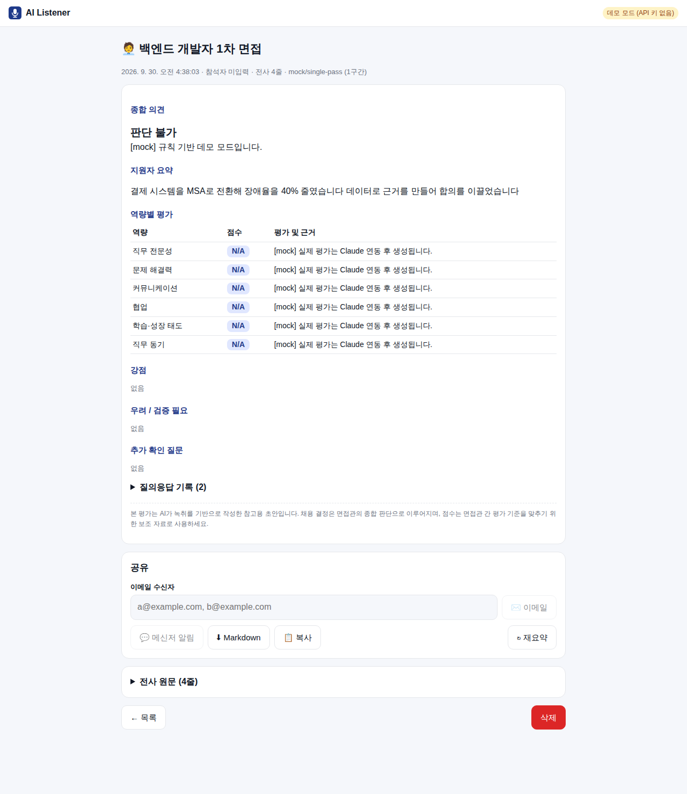

# AI Listener

회의·면접을 **웹 브라우저로 녹음**하면 실시간으로 받아 적고, 종료 후 **Claude가 요약**해 **이메일·메신저로 공유**하는 웹앱입니다. 모바일 웹과 PC 웹(마이크 필요)에서 설치 없이 동작합니다.

- **회의**: 개요 · 핵심 논의 · 결정 사항 · 할 일(담당/기한) · 일정 · 미결 이슈 → 일정은 `.ics`로 첨부돼 캘린더에 바로 등록
- **면접**: 공통 평가 기준표에 따른 역량별 점수 + **지원자 발화 인용 근거** · 강점 · 우려 · 추가 확인 질문 · 편향 점검
- **장시간 회의**: 10분 단위 중간요약(녹음 중 표시), 종료 후 원문 단일 패스 또는 map-reduce 최종 요약

## 문서
| 문서 | 내용 |
|---|---|
| [01. 기획서](docs/01_기획서.md) | 추진 배경, 목표·KPI, 기능, **기획→배포 단계별 과정**, 청크 처리·프롬프트 설계 등 고려사항 |
| [02. AI 활용 개발 과정](docs/02_AI활용_개발과정.md) | **Claude를 활용한 단계별 예상 개발 과정** (예시 프롬프트, 사람 검토 지점, 공수 비교) |
| [03. 기술 설계](docs/03_기술설계.md) | 아키텍처, 데이터 모델, 요약 파이프라인, Claude API 호출, API 명세, 보안 |
| [04. 배포·운영](docs/04_배포운영.md) | Docker/HTTPS 배포, 환경변수, 점검표, 운영 |

## 빠른 시작
```bash
npm install            # @anthropic-ai/sdk, nodemailer (선택 의존성)
cp .env.example .env   # ANTHROPIC_API_KEY 입력 (없으면 데모 모드로 동작)
npm start              # http://localhost:3000
npm test               # 단위 + API 통합 테스트
```
- `localhost`는 HTTP로도 마이크를 쓸 수 있지만, **다른 기기(휴대폰)에서 접속하려면 HTTPS가 필요**합니다 → [배포 가이드](docs/04_배포운영.md)
- API 키 없이 실행하면 규칙 기반 **mock 요약기**로 화면과 흐름을 확인할 수 있습니다.

## 구조
```
server/
  index.js       진입점
  app.js         HTTP 라우팅·정적 파일·인증 (Node 내장 http, 프레임워크 없음)
  store.js       파일 기반 세션 저장소 (세션별 락, 원자적 쓰기)
  chunker.js     장시간 전사 청크 분할
  pipeline.js    중간요약(map) → 최종요약(single-pass | reduce) → 자동 발송
  prompts.js     system/user 프롬프트
  schemas.js     Structured Outputs JSON Schema + 검증기
  summarizer.js  Claude(스트리밍·캐싱·폴백) / mock
  notify.js      SMTP 메일, Slack/Teams 웹훅
  ics.js         일정 → iCalendar
  report.js      Markdown / HTML / 메신저 텍스트
  stt.js         Whisper 호환 서버 STT 어댑터
public/          웹 프론트엔드 (app.js, recorder.js, styles.css)
test/            node:test 테스트
```

## 화면
| 세션 생성 | 녹음 | 회의 결과 | 면접 결과 |
|---|---|---|---|
|  |  |  |  |

*(스크린샷은 데모 모드 결과입니다. Claude 연동 시 실제 요약·평가가 채워집니다.)*

## 프로젝트 보드 관리 (GitHub Actions)
[Project items](.github/workflows/project-items.yml) 워크플로로 [프로젝트 보드](https://github.com/users/gionty0805/projects/2)의 아이템을 조회·생성·수정·보관·삭제합니다.
- 준비: 저장소 시크릿 `PROJECT_TOKEN`에 `project` 권한이 있는 PAT 등록
- 실행: Actions → **Project items** → Run workflow → `action` 선택
  - `list`: 아이템 ID(`PVTI_...`)와 필드 값, 선택 가능한 옵션을 실행 요약에 표시
  - `create`: 드래프트 생성 (`title`, `body`, `fields`) / `add-issue`: 이 저장소 이슈·PR 추가 (`issue_number`)
  - `update`: 필드 값 변경 (`item_id`, `fields`, 드래프트는 `title`/`body`도) / `archive`·`unarchive`·`delete`
  - `fields` 예: `{"Status":"In Progress","Priority":"High","Due":"2026-10-31"}` (빈 문자열은 값 비우기)
