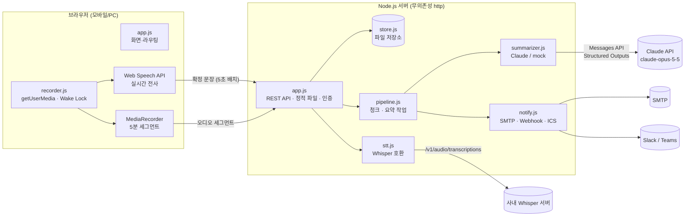

# 기술 설계

## 1. 아키텍처



| 결정 | 이유 |
|---|---|
| 웹앱(설치 없음) | 모바일·PC 모두 링크 하나로 사용, 배포·업데이트 단순 |
| 서버 무의존성(Node 내장 `http`) | 공급망 위험 최소화, 폐쇄망 배포 쉬움. 선택 의존성은 `@anthropic-ai/sdk`, `nodemailer` 둘뿐이며 필요할 때만 로딩 |
| 파일 저장소(MVP) | 운영 부담 없음. 세션별 락 + 임시파일→rename 원자적 쓰기. 2단계에서 PostgreSQL로 교체 (`Store` 인터페이스 유지) |
| 요약은 서버에서만 | API 키가 브라우저에 노출되지 않음 |
| STT 이원화 | 브라우저(무료·실시간) ↔ 사내 Whisper(보안·정확도)를 설정으로 전환 |

## 2. 데이터 모델

`data/sessions/<id>/session.json`
```jsonc
{
  "id": "f17d78a4e56d031f",
  "type": "meeting",                 // meeting | interview
  "title": "3분기 서비스 기획 회의",
  "participants": ["김팀장", "이선임"],
  "recipients": ["team@example.com"],
  "rubric": [],                      // 면접: 평가 역량 목록
  "jobDescription": "", "agenda": "",
  "consent": { "agreed": true, "at": "2026-09-30T04:37:31Z" },
  "status": "done",                  // recording → summarizing → done | error
  "startedAt": "...", "endedAt": "...", "durationMs": 3600000,
  "chunks": [ { "index": 0, "lineFrom": 0, "lineTo": 42, "range": "00:00~09:58", "notes": { /* chunkNotesSchema */ }, "usage": {} } ],
  "summary": { /* meetingSummarySchema | interviewSummarySchema */ },
  "summaryMeta": { "engine": "claude", "model": "...", "strategy": "single-pass", "chunks": 6, "usage": {}, "ms": 41000 },
  "notifications": [ { "channel": "email", "to": ["..."], "at": "..." } ],
  "audioSegments": [ { "seq": 0, "startMs": 0, "bytes": 1200000, "mime": "audio/webm", "lines": 38 } ]
}
```
`transcript.json`: `[{ "t": 12000, "speaker": "김팀장", "text": "…", "src": "browser|whisper|note" }]` — `t`는 녹음 시작 기준 ms(일시정지 시간 제외)

## 3. 요약 처리 상세

### 3.1 청크 알고리즘 (`server/chunker.js`)
```
planChunks(lines, fromLine, {minutes, maxChars}, final):
  start = fromLine, chars = 0
  for i in fromLine..end:
    chars += len(lines[i]) + 12            # 타임스탬프·화자 표기 여유분
    timeCut = 다음 라인이 있고 (다음.t - lines[start].t) ≥ minutes
    sizeCut = chars ≥ maxChars
    if timeCut or sizeCut: 청크[start, i+1) 확정, start = i+1
  if final and start < end: 남은 라인을 마지막 청크로
```
- 녹음 중(`final=false`)에는 **다음 발화가 도착해 구간이 확실히 닫혔을 때만** 청크를 만든다.
- 경계는 항상 라인 단위 → 발화가 잘리지 않는다.
- 요약 시 직전 6줄을 `<previous_context>`로 함께 보낸다.

### 3.2 파이프라인 (`server/pipeline.js`)
| 시점 | 동작 |
|---|---|
| 전사 라인 추가 | `onTranscript` → 닫힌 청크가 있으면 중간노트 생성 (세션 단위 직렬 큐, 중복 실행 없음) |
| 종료 | 남은 라인으로 마지막 청크 → 전사문 크기로 전략 선택 → 최종 요약 → 저장 → 자동 발송(설정 시) → 원본 음성 삭제(기본) |
| 실패 | `retryable` 오류(429·5xx·연결·JSON 파싱)는 2s·4s 백오프로 2회 재시도, 그래도 실패면 `status=error` + 메시지 → 화면에서 "다시 요약" |
| 서버 재시작 | `status=summarizing` 세션을 찾아 다시 처리 |

### 3.3 Claude API 호출 (`server/summarizer.js`)
```js
client.beta.messages.stream({
  model: 'claude-opus-5-5',
  max_tokens: 64000,                                  // 최종 요약 (중간노트는 16000)
  system: [{ type: 'text', text: SYSTEM_MEETING, cache_control: { type: 'ephemeral' } }],
  messages: [{ role: 'user', content: '<context>…</context><transcript>…</transcript>…' }],
  output_config: { effort: 'high', format: { type: 'json_schema', schema: meetingSummarySchema } },
  betas: ['server-side-fallback-2026-07-01'],
  fallbacks: 'default',
}).finalMessage();
```
| 옵션 | 이유 |
|---|---|
| 스트리밍 + `finalMessage()` | 긴 입력·출력에서 HTTP 타임아웃 방지 |
| `output_config.format` (JSON Schema) | 출력 형식 보장 → 파싱 실패 제거. 서버에서 한 번 더 `validate()` |
| `cache_control` (system) | 고정 지시문을 캐시 → 구간마다 반복되는 입력 비용 절감 |
| `effort` | 최종 요약 `high`, 중간노트 `medium` (환경변수로 조정) |
| `fallbacks: 'default'` | 안전 분류기가 요청을 거절하면 서버가 권장 모델로 자동 재시도 (`CLAUDE_FALLBACKS=false`로 끔) |
| `stop_reason` 확인 | `refusal` → 사용자에게 사유 표시, `max_tokens` → 재시도 |
| 오류 분류 | `RateLimitError`·`APIConnectionError`·5xx → 재시도 / `AuthenticationError`·`BadRequestError` → 즉시 실패 |

### 3.4 프롬프트 구조 (`server/prompts.js`)
```
[system — 고정, 캐시]
  역할 · 목적 · 작성 기준 · 공통 규칙(인젝션 방어, STT 오류, 환각 금지, 날짜 환산)

[user — 세션마다 다름]
  <context> 유형 · 제목 · 기준 일시(요일, 시간대) · 참석자 · 안건 </context>
  <rubric> (면접) 평가 역량 </rubric>
  <job_description> (면접) </job_description>
  <transcript> [mm:ss] 화자: 발화 … </transcript>      ← 단일 패스
  또는 <chunk_notes> <part index range> … </part> </chunk_notes>  ← map-reduce
  지시 한 줄
```

## 4. API 명세

| Method | Path | 설명 |
|---|---|---|
| GET | `/api/config` | 요약 엔진·STT 모드·청크 설정·알림 가능 여부 (인증 불필요) |
| GET | `/api/sessions` | 목록 |
| POST | `/api/sessions` | 생성 `{type, title, participants, recipients, rubric, jobDescription, agenda, consent:true}` |
| GET | `/api/sessions/:id` | 상세 + 전사 |
| DELETE | `/api/sessions/:id` | 영구 삭제 |
| POST | `/api/sessions/:id/transcript` | 전사 라인 추가 `{lines:[{t,speaker,text,src?}]}` (녹음 중에만) |
| POST | `/api/sessions/:id/audio?seq&startMs&speaker` | 오디오 세그먼트(본문=바이너리, 최대 50MB, seq 중복 시 무시) |
| POST | `/api/sessions/:id/finish` | 녹음 종료 → 요약 시작 |
| POST | `/api/sessions/:id/summarize` | 재요약 |
| POST | `/api/sessions/:id/notify` | `{email:{to:[…]}}` 또는 `{webhook:true}` |
| GET | `/api/sessions/:id/export.md` | Markdown 내보내기 |

`APP_ACCESS_TOKEN` 설정 시 `x-access-token` 헤더 필요(상수 시간 비교).

## 5. 보안

| 위협 | 대응 |
|---|---|
| 무단 접근 | 접근 코드(`APP_ACCESS_TOKEN`, 상수 시간 비교). **운영(`NODE_ENV=production`)에서는 접근 코드 없이 기동 거부** (`ALLOW_NO_AUTH=true`로만 해제). 2단계: 사내 SSO |
| 접근 코드 무차별 대입 | IP당 분당 요청 한도(`RATE_LIMIT_PER_MINUTE`, 기본 240) — 401 응답도 한도에 포함 |
| 비용 남용(재요약 반복 등) | 세션 생성·종료·재요약·발송은 IP당 분당 6회(`RATE_LIMIT_COSTLY_PER_MINUTE`) |
| CSRF | 인증은 쿠키가 아닌 커스텀 헤더 + 모든 상태 변경 요청에서 CORS simple Content-Type(`text/plain`, form, 없음) 거부 → 다른 사이트에서 사전요청 없이 호출 불가 |
| 도청 | HTTPS 필수 (브라우저 마이크 정책상 HTTP에서는 동작 안 함), Caddy에서 HSTS |
| 경로 탐색 | 정적 파일 경로를 `public/` 안으로 제한, 세션 ID 형식 검증(16자리 hex) |
| 업로드·디스크 고갈 | JSON 2MB, 오디오 50MB·허용 MIME 화이트리스트, 세션당 전사 2만 줄·오디오 150개 상한 |
| XSS·클릭재킹 | 화면·메일 렌더링 시 모든 사용자/모델 텍스트 escape, CSP(`script-src 'self'`, 인라인 스크립트 없음), `frame-ancestors 'none'` + `X-Frame-Options: DENY` |
| 메일을 통한 외부 유출·스팸 | 수신 도메인 허용목록(`MAIL_ALLOWED_DOMAINS`), 수신자 최대 50명 |
| 메신저 멘션 주입 | Slack 메시지에서 `& < >` 이스케이프 → 전사문 속 `<!channel>` 등 무력화 |
| 프롬프트 인젝션 | 전사문을 태그로 격리 + "지시문 무시" 규칙 + 출력은 스키마 강제(도구 호출 없음 → 피해 범위 제한) |
| 내부 정보 노출 | 500 응답·요약 실패 메시지는 일반 문구, 상세는 서버 로그에만 |
| 개인정보 | 동의 필수, 원본 음성 자동 삭제, 삭제 기능, API 키는 서버 환경변수로만 |
| 헤더 | CSP, `nosniff`, `referrer-policy`, `permissions-policy: microphone=(self)`, `X-Frame-Options` |

**남은 위험 (2단계 과제)**
- 접근 코드는 공용 1개라 **사용자별 권한 구분이 없음** → 코드를 아는 사람은 모든 면접 기록을 볼 수 있음. SSO + 작성자/HR 역할 기반 접근 제어 필요.
- 접근 코드를 브라우저 `localStorage`에 저장 → XSS가 생기면 탈취 가능 (CSP로 완화). SSO 도입 시 httpOnly·SameSite 세션 쿠키로 교체.
- 의존성 잠금 파일(`package-lock.json`) 미커밋 — 개발 환경에서 레지스트리 접근이 막혀 생성하지 못함. 배포 전에 `npm install`로 생성·커밋하고 Docker에서 `npm ci` 사용, `npm audit` 확인.
- 저장 데이터(전사·요약)는 평문 파일 → 디스크 암호화 볼륨 사용 권장.

## 6. 알려진 한계
- 화자 자동 분리 없음 (수동 화자 버튼으로 보완).
- 브라우저 STT는 기기·브라우저마다 품질이 다르고, 탭을 벗어나면 중단될 수 있음.
- 서버 STT 모드에서 세그먼트 결과가 순서가 바뀌어 늦게 도착하면 이미 만든 중간노트 경계와 어긋날 수 있음(최종 요약은 원문 전체를 다시 쓰므로 단일 패스에서는 영향 없음).
- 파일 저장소는 단일 서버 전제. 여러 대로 늘리려면 DB + 작업 큐(예: Redis 기반)로 전환.
